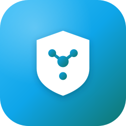

<p align="center">
  
</p>

# Amnezia Admin (awg-admin)

[Русская версия](README_ru.md)

**Amnezia Admin** is an admin tool for managing [AmneziaWG](https://github.com/amnezia-vpn/amneziawg-go)/WireGuard
servers, the VPN peers connected to them, and the users those peers belong to. One admin instance can manage many
servers at once; each server runs a small agent that owns the actual WireGuard interfaces on that box.

> 📖 **Full feature guide:** [docs/GUIDE.md](docs/GUIDE.md) — a complete walkthrough of every feature.

## What it's for

- Create and configure WireGuard/AmneziaWG interfaces on remote servers without SSH'ing in by hand — addresses, keys and
  AmneziaWG obfuscation parameters are filled in for you.
- Manage users and issue/revoke VPN peers (keys, allowed IPs, QR codes and ready-to-use client configs) per user.
- Deploy the per-server agent over SSH with one click, keep its config in sync, and **reconcile** what the agent
  actually has against your database when they drift.
- Chain servers into **multi-hop tunnels** so clients egress the internet through a chosen exit node.
- Watch server health — load average, RAM, and per-peer traffic activity — from one place.
- **Back up** your whole setup to a portable file at any time.
- Reach agents over an automatic SSH tunnel, or directly via mTLS on a public IP.
- Run either as a local desktop app or as a small web service you host yourself — your data stays on infrastructure you
  control, never a third-party cloud.

See the [full guide](docs/GUIDE.md) for how each of these works.

## Components

| Component     | What it is                                                                                                                                                                                                             | Where                         |
|---------------|------------------------------------------------------------------------------------------------------------------------------------------------------------------------------------------------------------------------|-------------------------------|
| **Admin app** | The thing you actually interact with. Either a Wails desktop app, or a standalone web server — same business logic, same React frontend, two different shells.                                                         | root Go module + `frontend/`  |
| **Agent**     | A small HTTP daemon you deploy to each managed server. It talks to the real WireGuard/AmneziaWG interfaces via `wgctrl-go` and exposes a CRUD API the admin app calls (over an SSH tunnel by default, or direct mTLS). | `agent/` (separate Go module) |
| **Frontend**  | React 19 + TypeScript SPA. Detects at runtime whether it's running inside the Wails desktop shell or talking to the standalone server over HTTP, and switches transport accordingly — same UI either way.              | `frontend/`                   |

The admin app keeps all of its own metadata (servers, SSH credentials, users, peer assignments) in a local embedded
database (boltdb, `~/.awg-admin`) — it is the source of truth; the agent just applies whatever config it's pushed.

## Running it

### Desktop app

Download the build for your OS from the [Releases](../../releases) page:

- **Windows** — `amnezia-admin-amd64-installer_<version>.exe` (NSIS installer), or the plain
  `amnezia-admin_<version>.exe`.
- **macOS** — `amnezia-admin_<version>.dmg` (universal: Intel + Apple Silicon). The app isn't notarized/signed by an
  Apple Developer ID — on first launch, right-click the app → Open to bypass Gatekeeper, or run
  `xattr -cr "/Applications/Amnezia Admin.app"`.
- **Linux** — plain binary (`amnezia-admin_<version>`); requires `libgtk-3` and `libwebkit2gtk-4.1` to be installed.

No login, no setup — it's a local single-user app.

### Standalone server

For when you want to reach the admin UI from a browser instead, or run it on a headless box.

**Binary:**

```sh
./awg-admin
# listens on :8080 by default
```

**Docker:**

```sh
docker run -d --name awg-admin \
  -p 8080:8080 \
  -v awg-admin-data:/data \
  ghcr.io/<owner>/<repo>:latest
```

First login is **admin / admin** — change it immediately under *Settings* (or via the `PUT /auth/change-credentials`
API). The standalone server is the only mode with a login screen; the desktop app has no network exposure to
authenticate against.

Configuration is via environment variables:

| Variable                                   | Purpose                                                                                                                                             |
|--------------------------------------------|-----------------------------------------------------------------------------------------------------------------------------------------------------|
| `AWG_ADMIN_ADDR`                           | Listen address, default `:8080`                                                                                                                     |
| `AWG_ADMIN_TLS_CERT` / `AWG_ADMIN_TLS_KEY` | Serve HTTPS with a static cert/key pair                                                                                                             |
| `AWG_ADMIN_AUTOCERT_DOMAINS`               | Comma-separated domains to get a cert for automatically from Let's Encrypt (mutually exclusive with the static cert above; needs port 80 reachable) |
| `AWG_ADMIN_AUTOCERT_CACHE_DIR`             | Where to cache the autocert certificate, default `$HOME/.awg-admin-autocert`                                                                        |

Data lives under `$HOME` — the boltdb file at `$HOME/.awg-admin`, the autocert cache at `$HOME/.awg-admin-autocert`,
and (if you use deploy presets with local caching — see "Agent" below) downloaded agent binaries at
`$HOME/.awg-admin-cache`. In the Docker image `$HOME` is `/data`, which is why it's set up as a mountable volume.

### Agent

Deployed automatically by the admin app (server page → "Deploy agent", given SSH access to the box), or by hand:

```sh
AWG_AGENT_ADDR=127.0.0.1:8080 AWG_AGENT_DB=/var/lib/awg-agent ./awg-agent
```

| Variable                                                               | Purpose                                                                                                                                  |
|------------------------------------------------------------------------|------------------------------------------------------------------------------------------------------------------------------------------|
| `AWG_AGENT_ADDR`                                                       | Listen address, default `127.0.0.1:8080` (loopback — meant to be reached through an SSH tunnel from the admin app, not exposed directly) |
| `AWG_AGENT_DB`                                                         | Where the agent stores its own interface configs                                                                                         |
| `AWG_AGENT_TLS_CERT` / `AWG_AGENT_TLS_KEY` / `AWG_AGENT_TLS_CLIENT_CA` | Set all three to listen with mTLS instead, for reaching the agent directly on a public IP without an SSH tunnel                          |
| `AWG_AGENT_METRICS_INTERVAL`                                           | How often to sample CPU/RAM/network/peer stats, default `45s`                                                                            |
| `AWG_AGENT_LOG_LEVEL`                                                  | Log verbosity, default `info`                                                                                                            |

Linux only (it manages real WireGuard interfaces on the host), amd64/arm64.

### Moving data between two installs

If you've been using the desktop app and want to switch to the standalone server (or vice versa, or just migrate to a
new machine), use `awg-migrate` — it copies the boltdb file's contents to/from a portable JSON dump:

```sh
awg-migrate export -db ~/.awg-admin -out dump.json   # on the old machine
awg-migrate import -db ~/.awg-admin -in dump.json    # on the new machine
```

Both deployment modes already read the same file/format, so this is only needed when moving across machines. *Settings →
Backup* exports the same dump from inside the app with one click (desktop save dialog or browser download), and an
in-app backup is restored the same way — `awg-migrate import` it into the target database. See
the [backup section of the guide](docs/GUIDE.md#backup-restore-and-migration).

## Building from source

Requires Go 1.26.2+ and Node 24+.

```sh
make server      # standalone web server binary (build/bin/)
make run-server  # build frontend + go run, for local testing
make desktop     # Wails desktop binary (needs the Wails CLI: go tool wails)
make agent       # cross-compiles the agent for Linux (build/bin/)
make migrate     # awg-migrate export/import tool
```

## License

Apache License 2.0 — see [LICENSE](LICENSE).
